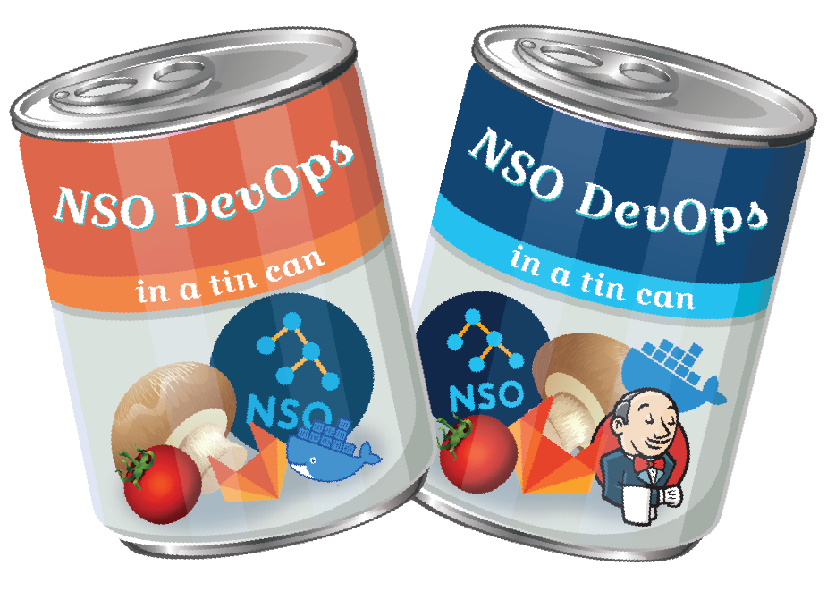

# 💻🤖🥫 NSO DevOps in a tin can 🥫🤖💻

<p align="center">
  
</p>

<p align="center">
<a href="https://developer.cisco.com/codeexchange/github/repo/ponchotitlan/NSO-DevOps-in-a-tin-can"></a>
  <a href="https://forthebadge.com"></a>
  <a href="https://forthebadge.com"></a>
  <a href="https://forthebadge.com"></a>
  <a href="https://forthebadge.com"></a>
</p>

## 🔥 But first, a horror story

Cisco NSO (Network Services Orchestrator) is the leading framework for our Service Provider and Enterprise network automation and orchestration. Entities of any size and reach can strongly benefit from its support for services development, as it is the power code what allows NetOps teams to unleash their true potential and craft all sorts of functionalities for automating their day-to-day operations, enhancing efficiency and reaching KPIs faster.

Now, imagine that incredibly awesome service which was developed for enhancing the operations of our network. NetOps team is very happy about it, and of course what makes sense now is to add more features. So, the effort estimation is done with the Software Development Team, and new User Stories begin to unroll. After the expected time, the new code is ready and deployed in production.

However, the next morning, the software team is flooded with tickets! The service seems to be unstable as features that were working before are crashing, and the operations can't be done through it no more. _"Guess it will be one more night of debugging and troubleshooting"_, the dev team wonders ... Now, the NetOps team has to fallback to doing things manually, which is taking time and money that automation was already saving.

<p align="center">
  
</p>

In the Post Mortem analysis, it was determined that many factors alligned to cause the malfunction of the service package: Code which corresponded to other User Stories was modified, tests focused entirely on the new features (no regresive testing), and a wrong version of the service package was put in the production NSO server.

The Software Development Team sits together to find a solution, while they share a warm bowl of soup right out of a practical, containerized tin can which will help them embrace a NetDevOps mindset across all their development lifecycle.

## 🍲 Motivation behind the soup

<p align="center">
  
</p>

The concept of *DevOps* was created to close the gap between the development and operations teams in Software projects, so that the new source code can make its way into a finalized, stable product in the most efficient and error-prone way possible.

TRIVIA: How frequently does Spotify perform product releases?</br>
a) Two months    b) Two weeks    c) Yearly

Answer: b) Two weeks!</br>
From code to our fingertips, the app and the services within are updated with bug fixes and new features in such short time, and most importantly, without any of us users noticing it.

The idea of bringing the goodness of DevOps into the network operations realm derived in the creation of a new term: NetDevOps. It consists on an incremental approach which makes use of the DevOps techniques to automate the development of new services, enhance the quality within, and ensure a proper, flawless deployment in production. The key tool from this mindset is, notoriously, the CICD workflows, or Continuous Integration / Continuous Delivery.

The intention of this containerized mockup is to showcase a very basic CICD workflow oriented towards NSO Use Case design and deployment. The different stages contemplate the setup required for automated testing, and the release of artifacts as a single source of truth for deployment in production. The purpose is not to execute the services developped right away, but rather to have consistent, error-proof releases ready to be operated by our NetOps users at their earliest convenience.

## 🥫 What's inside the tin can

There is no such things as "One size fits all" in the DevOps world. Hence, this repository aims to provide a couple of examples using different Open Source tools, while achieving the same results. 

The soup comes in two flavours:

### 🥫 GitLab & Jenkins
Being one of the pioneers, Jenkins is a leading Open Source CICD platform. It is likely that you will find it, specially in massive DevOps workflows or legacy layouts. Hence, it is important to know how does it operate and how can it be leveraged for our NSO development purposes. In this soup flavour, it is integrated with GitLab - both as containerized solutions.

Navigate to the location ```gitlab_&_jenkins_soup/``` to get started!

### 🥫 GitLab (standalone)
Gitlab has been gaining popularity recently as the single-pane-of-glass solution for all our development lifecycle. The introduction of Gitlab Runners brought the capability of creating YAML-based pipelines which can be operated and monitored from within the same portal as the Source Code Repository management. Moreover, given that SCM and DevOps are part of the same solution, the setup process is much more simple and the DevOps stages can be easily integrated with the rest of the tols from the "orange tanooki".

Navigate to the location ```gitlab_soup/``` to get started!

---

Crafted with 🧡  by [Alfonso Sandoval - Cisco](https://linkedin.com/in/asandovalros)
