# 💻🤖🥫 NSO DevOps in a tin can 🥫🤖💻

<p align="center">
  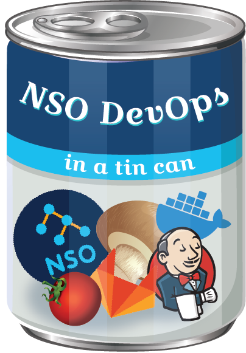
</p>

<p align="center">
  <a href="https://forthebadge.com"></a>
  <a href="https://forthebadge.com"></a>
  <a href="https://forthebadge.com"></a>
  <a href="https://forthebadge.com"></a>
</p>

<p align="center">
A warm bowl of NSO CICD soup straight from a tin can (containerized), yet with a homemade taste.</br>
Ingredients are: GitLab-CE + NSO + Jenkins + 🧡 
</p>

## 🔥 But first, a horror story

Cisco NSO (Network Services Orchestrator) is the leading framework for our Service Provider and Enterprise network automation and orchestration. Entities of any size and reach can strongly benefit from its support for services development, as it is the power code what allows NetOps teams to unleash their true potential and craft all sorts of functionalities for automating their day-to-day operations, enhancing efficiency and reaching KPIs faster.

Now, imagine that incredibly awesome service which was developed for enhancing the operations of our network. NetOps team is very happy about it, and of course what makes sense now is to add more features. So, the effort estimation is done with the Software Development Team, and new User Stories begin to unroll. After the expected time, the new code is ready and deployed in production.

However, the next morning, the software team is flooded with tickets! The service seems to be unstable as features that were working before are crashing, and the operations can't be done through it no more. _"Guess it will be one more night of debugging and troubleshooting"_, the dev team wonders ... Now, the NetOps team has to fallback to doing things manually, which is taking time and money that automation was already saving.

<p align="center">
  
</p>

In the Post Mortem analysis, it was determined that many factors alligned to cause the malfunction of the service package: Code which corresponded to other User Stories was modified, tests focused entirely on the new features (no regresive testing), and a wrong version of the service package was put in the production NSO server.

The Software Development Team sits together to find a solution, while they share a warm bowl of soup right out of a practical, containerized tin can which will help them embrace a NetDevOps mindset across all their development lifecycle.

## 🍲 Motivation behind the soup

<p align="center">
  
</p>

The concept of *DevOps* was created to close the gap between the development and operations teams in Software projects, so that the new source code can make its way into a finalized, stable product in the most efficient and error-prone way possible.

TRIVIA: How frequently does Spotify perform product releases?</br>
a) Two months    b) Two weeks    c) Yearly

Answer: b) Two weeks!</br>
From code to our fingertips, the app and the services within are updated with bug fixes and new features in such short time, and most importantly, without any of us users noticing it.

The idea of bringing the goodness of DevOps into the network operations realm derived in the creation of a new term: NetDevOps. It consists on an incremental approach which makes use of the DevOps techniques to automate the development of new services, enhance the quality within, and ensure a proper, flawless deployment in production. The key tool from this mindset is, notoriously, the CICD workflows, or Continuous Integration / Continuous Delivery.

The intention of this containerized mockup is to showcase a very basic CICD workflow oriented towards NSO Use Case design and deployment. The different stages contemplate the setup required for automated testing, and the release of artifacts as a single source of truth for deployment in production. The purpose is not to execute the services developped right away, but rather to have consistent, error-proof releases ready to be operated by our NetOps users at their earliest convenience.

## 🥫 What's inside the tin can

The following diagram shows the architecture of the ingredients (containers) within this tomato-ey repository:


<p align="center">
  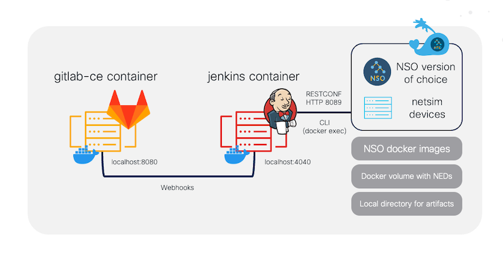
</p>

The current version of the project makes use of a Gitlab-CE container as a SCM (Source Code Manager) and a Jenkins container as the CICD platform. For the very basic purposes of NSO testing, Gitlab-CE along with Gitlab Runner is enough. However, in this version of the project it is intended to demonstrate that the communication between Jenkins and Gitlab-CE is possible, allowing for the usage of the rich plugin marketplace that is available for Jenkins.

Our CICD environment makes use of the [NSO as Docker](https://github.com/NSO-developer/nso-docker) project to provide a testing and deployment platform which is dynamically setup and wiped out based on your project's requirements. That means, for every run we can specify the NSO version that our project needs. Moreover, the project uses ncs-netsim virtual devices right inside this NSO container. This is a very simple approach for quick services ad-hoc testing, as we can specify in our environment which are the NEDs, amount of devices, and device names that we want to use for testing. And again, everything is wiped out once our workflow run is complete.

Finally, the project structure provides all the scripts that we need for customizing our CICD environment based on our needs. As of now, the code within is hardcoded for a demo testcase, however the code is well documented to make it easy to navigate and modify.

<p align="center">
  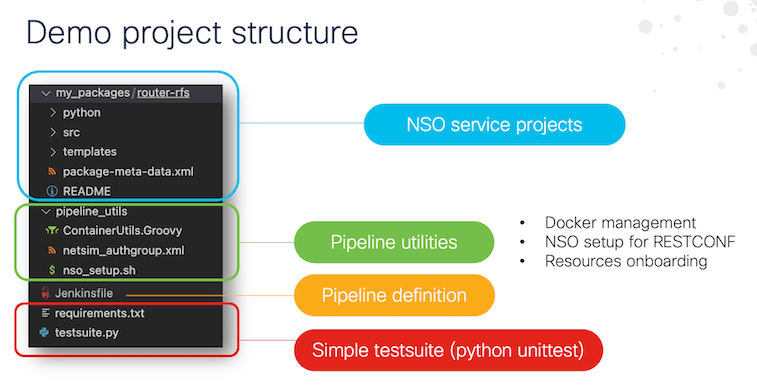
</p>


## 🍜 Warming up the delicious soup

First of all, let's pour the contents of the tin can into a bowl. This repository has a setup file for spinning up all the containers that we need to get started. 
The system requirements consist on the following:

- Linux-based OS. This repository has been tested on CentOS and MacOS
- Docker engine
- Docker compose
- Python v3.9x

To get started, clone the repository in your host:
```
git clone https://github.com/ponchotitlan/NSO-DevOps-in-a-tin-can.git
```

Once copied, navigate to the repository source and run the following command:
```
sh setup.sh
```

The output shall be similar to the following one:
```

Warming up the contents of this tin can! 🥫🥫🥫

Setting up the Gitlab-CE container. This is our Control Versioning System (Setup will take some time) ... 🦊

Now, let's wait for Gitlab-CE web portal to be available ... 🦊

⏳⏳⏳⏳⏳⏳⏳⏳⏳⏳⏳⏳⏳⏳⏳⏳HTTP/1.1 302 Found
Success! You can login now to Gitlab-CE with the following information

    🦊 Address: localhost:8080
    👤 User: root
    🔑 Password: cisco123

You can change these credentials later on via the platform.
These credentials are available in the log file /gitlab-ce/gitlab_setup.log in this repository

Setting up the Jenkins container. This is our orchestrator (Setup will take some time as well) ... 💂

Likewise, let's wait for Jenkins web portal to be available ... 💂

⏳⏳⏳⏳⏳⏳⏳⏳⏳⏳⏳⏳⏳⏳⏳⏳HTTP/1.1 403 Forbidden
Success! You can login now to Jenkins with the following information

    💂 Address: localhost:4040
    🔑 Unlocking password: 24c86e86888b471bab7ed95049833811

Please perform the initial setup as shown in the README and the Wiki.
These credentials are available in the log file /jenkins/gitlab_setup.log in this repository

```

This will create a series of folders and spin-up the required containers for our CICD system:

- _/nso_cicd_tincan/neds_ folder in your ${HOME} directory
- _/gitlab_ folder in your ${HOME} directory
- _/jenkins_ folder in your ${HOME} directory
- _gitlab-ce_ Docker container
- _jenkins_ Docker container

```

% docker ps
CONTAINER ID   IMAGE                    COMMAND                  CREATED          STATUS                    PORTS                                                 NAMES
3b82a46a94f9   jenkins/jenkins:lts      "/usr/bin/tini -- /u…"   21 minutes ago   Up 21 minutes             0.0.0.0:50000->50000/tcp, 0.0.0.0:4040->8080/tcp      jenkins
dc2f982239e8   yrzr/gitlab-ce-arm64v8   "/assets/wrapper"        48 minutes ago   Up 48 minutes (healthy)   22/tcp, 0.0.0.0:8080->80/tcp, 0.0.0.0:8443->443/tcp   gitlab-ce

```

The platform web interfaces will be available in the following locations:

- Gitlab-CE: localhost:8080
- Jenkins: localhost:4040

Our Jenkins server requires some additional configurations, such as the installation of [Docker in Debian](https://docs.docker.com/engine/install/debian/) and [pip in Debian](https://linuxhint.com/install-python-pip-debian/). This will allow our Jenkins platform to make use of our host Docker engine for managing the NSO container, and installing our python libraries for running our tests.

Please login to the Jenkins container and refer to the links aforementioned for easy installation via CLI. An automated way of fulfilling this is on the works :)
```
docker exec -it jenkins bash
```

Now, let's spin our own [NSO Docker containers](https://github.com/NSO-developer/nso-docker) for later use. The process with the official Cisco project is very straightforward:

Clone the official repository in your host:
```
git clone https://github.com/NSO-developer/nso-docker
```

Download the Cisco NSO free Linux signed.bin image for testing purposes [from this link](https://software.cisco.com/download/home/286331591/type/286283941/release/6.0). The version currently available is v6.0. Once downloaded, issue the following command to extract the installer file:

```
% sh nso-6.0.linux.x86_64.signed.bin . . .
nso-6.0.linux.x86_64.installer.bin
```

This will generate a series of files. Locate the one which ends in _.installer.bin_ and place it in the _nso-install-files/_ directory of the Docker for NSO repository.

Once done, issue a _make_ command in the root location of the directory:
```
% make
```

This will compile two different flavors of NSO docker images into your local collection. You can verify the completion with the following command:
```
%docker images
REPOSITORY                                                       TAG            IMAGE ID       CREATED         SIZE
cisco-nso-base                                                   6.0-root       d9839387d0f7   12 days ago     678MB
cisco-nso-dev                                                    6.0-root       7f68d9126959   12 days ago     1.43GB
```

Which is the main difference between the _base_ and the _dev_ images?</br></br>
The _base_ one is intended for standalone testing, which means that it is entirely isolated and can only run NSO with our packages within. This means that it cannot run ncs-netsim. For that, we have the _dev_ image, which as the title implies, is intended for development purposes. The latter also allows the persistance of our work by enforcing mounting volumes for our NSO version, packages and logs.

Now, which of these _flavours_ are we adding to our soup?</br></br>
For the sake of simplicity, we are using the _dev_ image. The reason? We want to have everything that is NSO related in a single container, as ephemeral as possible, so that the setup of the netsims and their onboarding can be as flexible and code-declarative as possible. It is possible, though, to have a NSO docker image running netsims exclusively. This can be done using the _nid skeleton_ features of the NSO for Docker project. However, the setup of docker networks and such is required. The mockup of this will be left for a v2.0 of this project. As of now, do not worry about the image to use, as the setup scripts of this repository take care of everything :D

The final step is to download the NEDs that we intend to use [from the same freebies link](https://software.cisco.com/download/home/286331591/type/286283941/release/6.0). We can choose between ASA, IOS, IOSXR and Nexus. In the same fashion as the NSO image, issue the command _make_ to extract the _.tar.gz_ file. Then, extract the folder within and copy it into the _/nso_cicd_tincan/neds_ folder in your ${HOME} directory:
```
% sh ncs-6.0-cisco-ios-6.88-freetrial.signed.bin . . .
tar -xvf ncs-6.0-cisco-ios-6.88.tar.gz . . .
/cisco-ios-6.88
```

## 🧂 Spicing the soup a little bit

The publishing of custom images for this purpose is on the works. For the time being, let's setup our Jenkins server to talk to Gitlab-CE.

Login to your Jenkins server 💂 for the first time using the generated password. Install the following plugins:
- git
- GitLab
- Pipeline
- Pipeline: Stage View

<p align="center">
  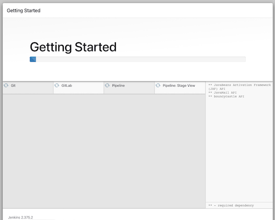
</p>

This might take some time. While the plugins are being installed, login to your Gitlab-CE 🦊 server and navigate to _Edit Profile > Access Tokens_. Create a new token and copy the code for later use:

<p align="center">
  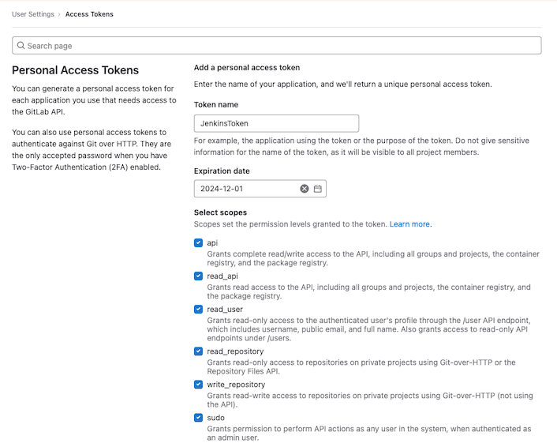

<p align="center">
  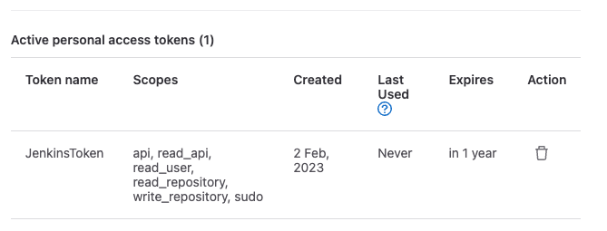
</p>

Once the plugins in the Jenkins server 💂 are installed, navigate to _Dashboard > Configure Jenkins > Gitlab_. Provide the IP address with the port 8080 of your Gitlab-CE local server. In the _Credentials_ section, click on _+ Add_ and create new credentials of the type _GitLab Access Key_. In the _API key_ field, provide the API token generated previously in your Gitlab-CE server.

<p align="center">
  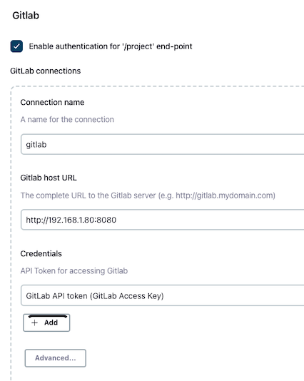
</p>

Click the _Test Connection_ button below. A light message reading "Successful" should appear in the corner of the panel.

Now that Jenkins and Gitlab-CE can talk to each other, it's time to link them further with a git project! The back and forth is getting a little bit cumbersome but trust me, it will be worth it. Login back to the Gitlab-CE 🦊 server, navigate to _Projects_ and click on _New Project_. 

<p align="center">
  
</p>

Navigate to your project and click _Clone > Clone with HTTP_. This will copy in your clipboard the URL of your project. We will need it for the next step:
```
Example: http://localhost/gitlab-instance-42118b3f/test-project.git
```

Time to setup our pipeline skeleton in the Jenkins server 💂 Log back in and navigate to _Dashboard > New Item > Multibranch Pipeline_. Create a new item of this type:

<p align="center">
  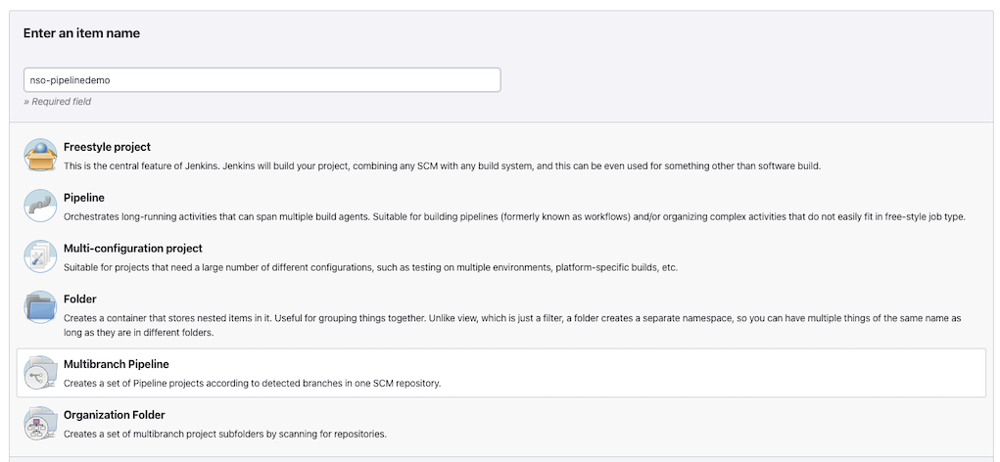
</p>

Now, navigate to your freshly created pipeline and go to _Configuration > Branch Sources_. Input the information of your Gitlab-CE project. Note how the URL of the project needs to be tweaked a little bit to include the username of your Gitlab-CE server, which in this case is "root":

```
Git project repository:
http://root@192.168.1.80:8080/gitlab-instance-42118b3f/test-project.git
```

<p align="center">
  
</p>

Now, for the credentials field: This Git plugin only accepts Username/Password simple credentials, hence Click on the _+ Add_ button and select the _Username with Password_ type. Input the credentials of your Gitlab-CE server (root/cisco123 by default). Afterwards, click on _Apply_ and _Save_.

Back into our Gitlab-CE 🦊 server, click in your fresh project. Navigate in the left panel to _Settings > Integrations_ and fetch the _Jenkins_ option.

<p align="center">
  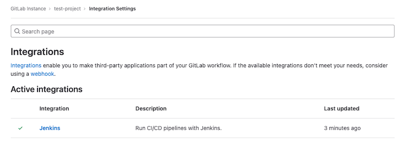
</p>

Provide the information from your Jenkins server, including the user and password. If you are working with the default credentials, the username is _"admin"_ and the password is available in the location _/jenkins/jenkins_setup.log_ of where you are hosting this repository:

<p align="center">
  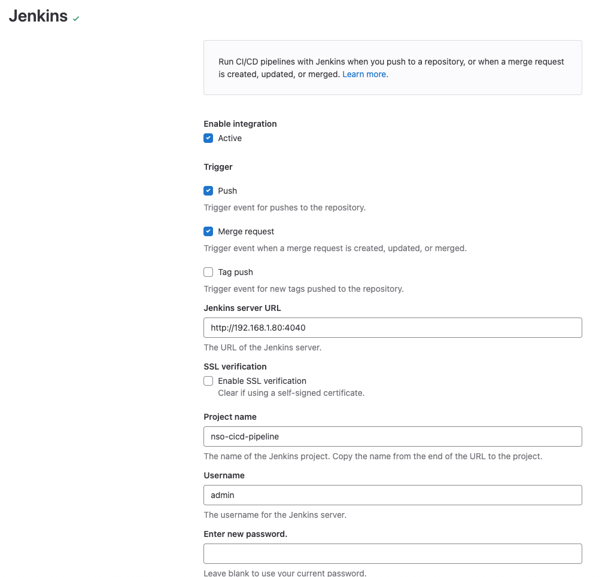
</p>

Click on the _Test Settings_ button. A connection validated messsge should popup, and the successful call should be displayed in the table below:

<p align="center">
  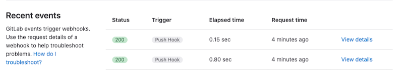
</p>

Phew .... that was quite something, isn't it?</br></br>

<p align="center">
  
</p>

But buckle up! It's about to get amazing ...

## 👩🏽‍🍳 Bon appetit!

In your Gitlab-CE 🦊  project, commit the project of this repository under the location _test_project/_. Any NSO service project that you want to test must be located under the folder _my_packages_. For demo purposes, there is a very simple service located there already, entitled _router-rfs/_.

<p align="center">
  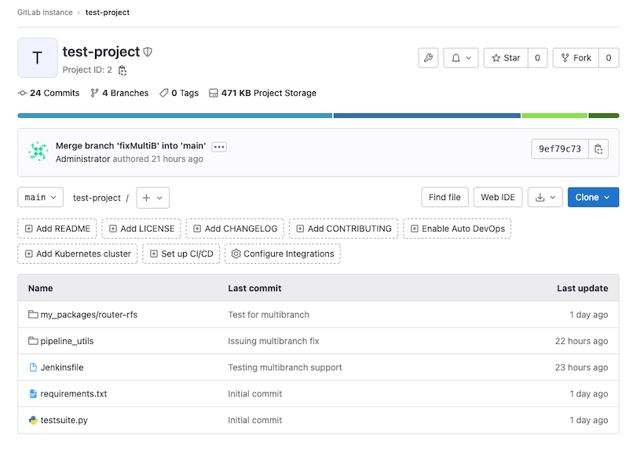
</p>

The moment you commit to the main or any other branch, Jenkins 💂 will be triggered right away!

<p align="center">
  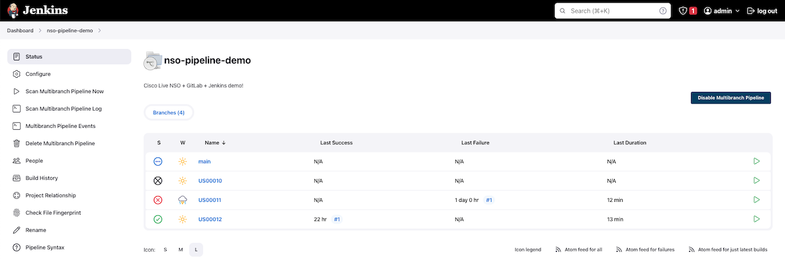
</p>

The different stages within the _Jenkinsfile_ will be shown in the main view of each branch:

<p align="center">
  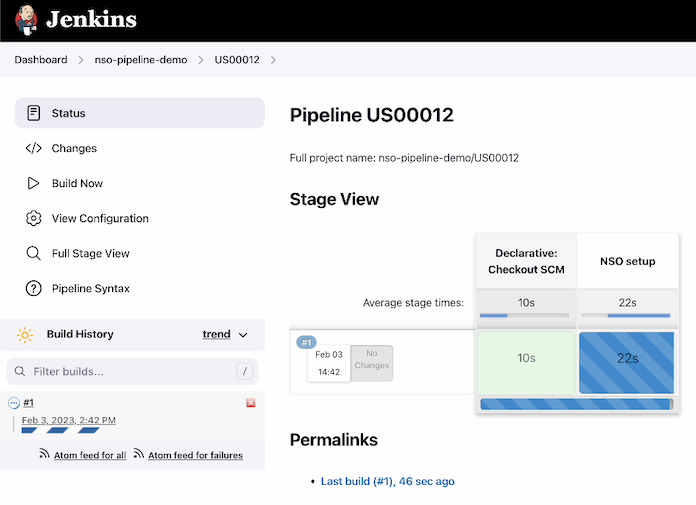
</p>

When clicking in the specific job in the lower left corner > _Console Output_, it is possible to see the progress of each stage, including the passing of the tests of our testsuite:

<p align="center">
  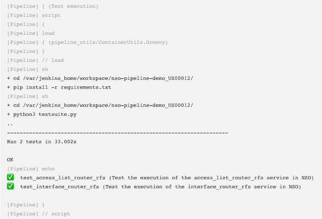
</p>

If the entire workflow goes flawlessly, we will have the following view stating that our release is stable and should be good for production:

<p align="center">
  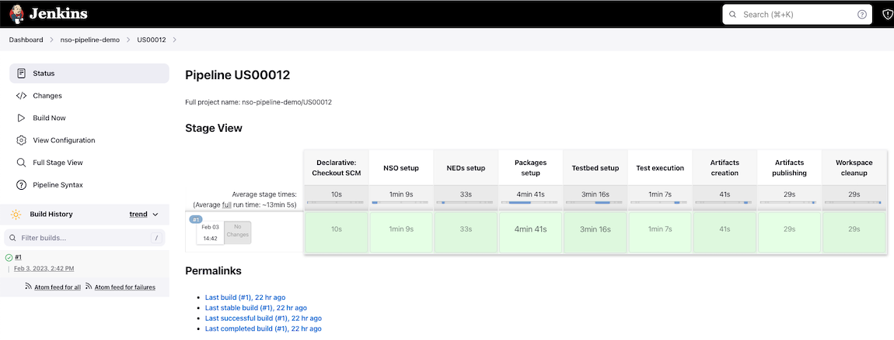
</p>

A compiled _.tar.gz_ file will be generated in the _/nso_cicd_tincan/neds/artifacts_ directory of your ${HOME} directory. The file will contain all the tested packages already compiled and bundled together. The intention is that this file is deployed in the production NSO server with a bash script which issues the replacement and packages reload, or any other sorts of automated mechanism. This file can also be kept in an artifactory server such as jFrog Artifactory (it was not included in this project as there is no Open Source version of it).

And voilá! Hopefully the soup is warm and tasty. Of course, this is a project in constant evolution, and it will be made more straightforward in subsequent versions.

Have fun with this nice and savoury concoction out of a tin can!

<p align="center">
  
</p>

---

Crafted with 🧡  by [Alfonso Sandoval - Cisco](https://linkedin.com/in/asandovalros)