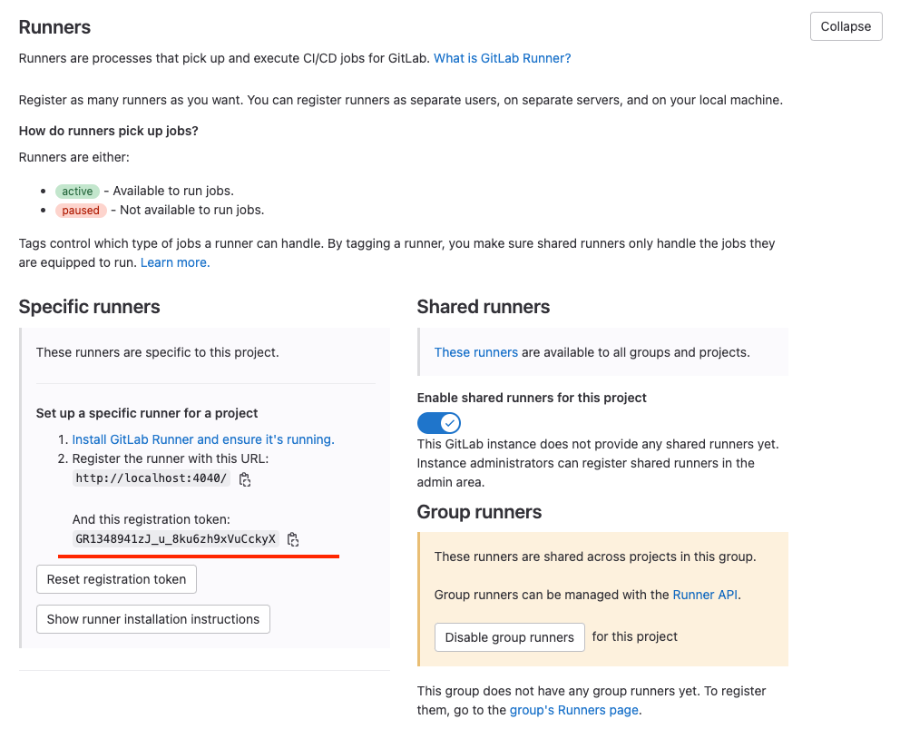
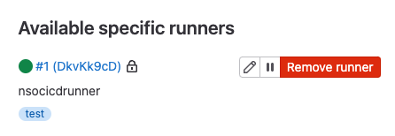
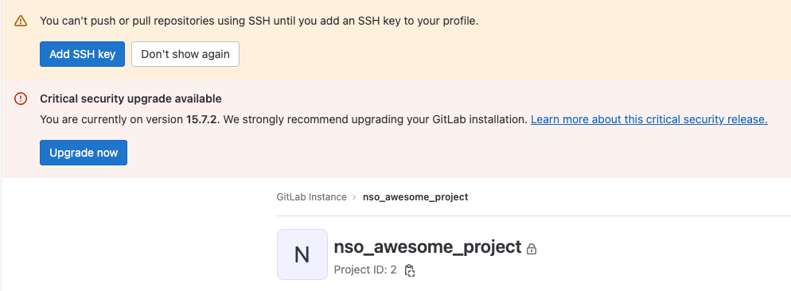
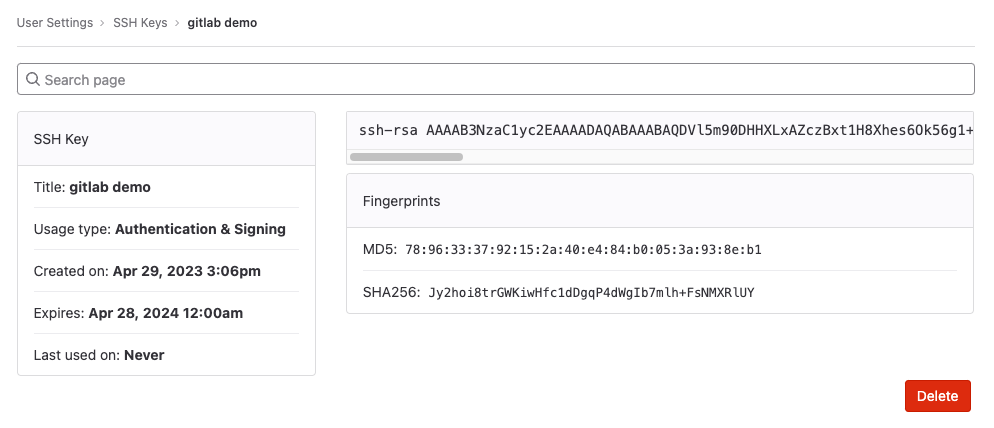

# 💻🤖🥫 NSO DevOps in a tin can 🥫🤖💻

## Now with more Orange Fox whiskers! 🦊

TBD - Cleaver and inspiring context for usage of gitlab + gitlab-runners

## 🍜 Warming up the delicious soup

First of all, let's pour the contents of the tin can into a bowl. This repository has a setup file for spinning up all the containers that we need to get started. 
The system requirements consist on the following:

- Linux-based OS. This repository has been tested on CentOS and MacOS
- Docker engine
- Docker compose
- Python v3.9x

To get started, clone the repository in your host:
```
git clone https://github.com/ponchotitlan/NSO-DevOps-in-a-tin-can.git
```

Once copied, navigate to the repository source and run the following command:
```
/gitlab_soup/sh setup.sh
```

The output shall be similar to the following one:
```
Warming up the contents of this tin can! 🥫🥫🥫
Setting up the Gitlab-CE container. This is our Control Versioning System (Setup will take some time) ... 🦊
Now, let's wait for Gitlab-CE web portal to be available ... 🦊

⏳⏳⏳⏳⏳⏳⏳⏳⏳⏳⏳⏳⏳⏳⏳⏳HTTP/1.1 302 Found
Success! You can login now to Gitlab-CE with the following information

    🦊 Address: localhost:4040
    👤 User: root
    🔑 Password: cisco123

You can change these credentials later on via the platform.
These credentials are available in the log file /gitlab-ce/gitlab_setup.log in this repository
```

This will create a series of folders and spin-up the required containers for our CICD system:

- _/nso_cicd_tincan/neds_ folder in your ${HOME} directory
- _/gitlab_ folder in your ${HOME} directory
- _gitlab-ce_ Docker container
- _gitlab-runner_ Docker container

Verify that the latter containers are actually running with the following command:

```
% docker ps
CONTAINER ID   IMAGE                         COMMAND                  CREATED         STATUS                   PORTS                                                 NAMES
4acf5bf64757   gitlab-ce                     "/assets/wrapper"        8 minutes ago   Up 8 minutes (healthy)   22/tcp, 0.0.0.0:4040->80/tcp, 0.0.0.0:8443->443/tcp   gitlab-ce
3d6dd0af82fd   gitlab/gitlab-runner:latest   "/usr/bin/dumb-init …"   8 minutes ago   Up 8 minutes                                                                   gitlab-runner
```

Login to the web UI of the GitLab platform located at ```localhost:4040``` using the credentials provided. Then, click on _New Project_ and add your very first repository in this GitLab container.

Now, we need to register a gitlab-runner instance for unlocking the CI/CD capabilities of your project!

For this, navigate to the menu on the left > Settings > CI/CD. Expand the *Runners* option and take note of the _Registration token_ field:

<p align="center">
  
</p>

Afterwards, open a terminal and navigate to the root of this repository and input the following command:

```
% cd gitlab_soup && docker-compose exec gitlab-runner gitlab-runner register
```

This will trigger an interactive registration process. Most of the values are pre-populated for you: if you see default values [in brackets], just hit enter to use them.

The resulting process should look like this:
```
% cd gitlab_soup && docker-compose exec gitlab-runner gitlab-runner register
WARN[0000] The "GITLAB_HOME" variable is not set. Defaulting to a blank string. 
WARN[0000] The "GITLAB_HOME" variable is not set. Defaulting to a blank string. 
WARN[0000] The "GITLAB_HOME" variable is not set. Defaulting to a blank string. 
Runtime platform                                    arch=arm64 os=linux pid=20 revision=436955cb version=15.11.0
Running in system-mode.                            
                                                   
Enter the GitLab instance URL (for example, https://gitlab.com/):
[http://gitlab]: 
Enter the registration token:
GR1348941zJ_u_8ku6zh9xVuCckyX
Enter a description for the runner:
[nsocicdrunner]: 
Enter tags for the runner (comma-separated):
test
Enter optional maintenance note for the runner:

WARNING: Support for registration tokens and runner parameters in the 'register' command has been deprecated in GitLab Runner 15.6 and will be replaced with support for authentication tokens. For more information, see https://gitlab.com/gitlab-org/gitlab/-/issues/380872 
Registering runner... succeeded                     runner=GR1348941zJ_u_8ku
Enter an executor: parallels, shell, docker+machine, docker-windows, docker, docker-ssh, ssh, virtualbox, docker-autoscaler, docker-ssh+machine, instance, custom, kubernetes:
[docker]: 
Enter the default Docker image (for example, ruby:2.7):
docker:latest
Runner registered successfully. Feel free to start it, but if it's running already the config should be automatically reloaded!
 
Configuration (with the authentication token) was saved in "/etc/gitlab-runner/config.toml" 
```

And voilà! The setup is done. You should see your runner registered in your project as follows when refreshing the GitLab website:

<p align="center">
  
</p>

The last thing to do here is to setup the SSH credentials that we will use to push our code back and forth from the new GitLab repository.

As you may have noticed, this yellow ribbon appeared when you first created the new project:

<p align="center">
  
</p>

Open a terminal and issue the following command for generating a brand new RSA key (the security algorithm is irrelevant for the purposes of this demo):

```
% ssh-keygen -t rsa -b 2048 -C "gitlab demo"
Generating public/private rsa key pair.
Enter file in which to save the key (/Users/.ssh/id_rsa): 
Enter passphrase (empty for no passphrase): 
Enter same passphrase again: 
Your identification has been saved in /Users/.ssh/id_rsa
Your public key has been saved in /Users/.ssh/id_rsa.pub
The key fingerprint is:
SHA256:Jy2hoi8trGWKiwHfc1dDgqP4dWgIb7mlh+FsNMXRlUY gitlab demo
The key's randomart image is:
+---[RSA 2048]----+
|      .. oE.     |
|     . o. o      |
|  .   = o..      |
|   + = + =       |
|. . @ * S =      |
|.. O @ . = .     |
|..=.@ o .        |
|o=+o.+ .         |
|*o o.            |
+----[SHA256]-----+
```

Now it's time to add it to our GitLab account. Issue the following command in your terminal to copy the contents of your key file into your clipboard:

macOS - 
```
tr -d '\n' < ~/.ssh/id_rsa.pub | pbcopy
```

Linux - 
```
xclip -sel clip < ~/.ssh/id_rsa.pub
```

Back on the GitLab interface, click the Blue button for adding an SSH Key and copy the clipboard contents into the box. Once submitted, the interface should look like this:

<p align="center">
  
</p>

Now let's move ahead with the NSO tooling.
---

Crafted with 🧡  by [Alfonso Sandoval - Cisco](https://linkedin.com/in/asandovalros)
