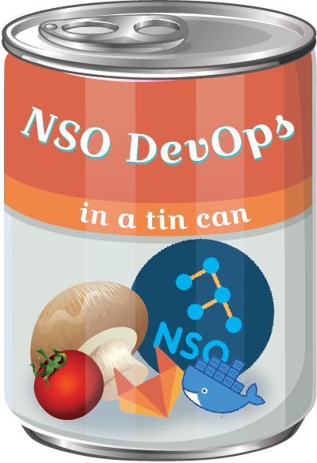

# 💻🤖🥫 NSO DevOps in a tin can 🥫🤖💻

<p align="center">
  
</p>

## Now with more Orange Fox whiskers! 🦊

Gitlab has been recently gaining popularity as the de-facto platform for project development. Its in-built tools allow the handling of the development lifecycle from top to bottom under a single pane of glass. The introduction og Gitlab Runners for DevOps capabilities enhance further the development experience, as it is possible to create, manage and monitor our DevOps pipeline from within the same portal, while also allowing for further integration with the other tools and with just some clicks and lines of code.

This repository aims to describe the setup from start to finish of a NSO-oriented NetDevOps pipeline.

## 🧅 Chopping some onions and NID images

First of all, let's spin our own [NSO Docker containers](https://github.com/NSO-developer/nso-docker) in our host operating system. These will be the images which we will later use for spinning up containers that work as our NSO test server and NETSIM virtual devices. The process with the official Cisco project is very straightforward:

Clone the official repository in your host:
```
git clone https://github.com/NSO-developer/nso-docker
```

Download the Cisco NSO free Linux signed.bin image for testing purposes [from this link](https://software.cisco.com/download/home/286331591/type/286283941/release/6.0). The version currently available is v6.0. Once downloaded, issue the following command to extract the installer file:

```
% sh nso-6.0.linux.x86_64.signed.bin . . .
nso-6.0.linux.x86_64.installer.bin
```

This will generate a series of files. Locate the one which ends in ```.installer.bin``` and place it in the ```nso-install-files/``` directory of the Docker for NSO repository.

Once done, issue the following command in the root location of the directory:
```
% make
```

This will compile two different flavors of NSO docker images into your local collection. You can verify the completion with the following command:
```
%docker images
REPOSITORY                                                       TAG            IMAGE ID       CREATED         SIZE
cisco-nso-base                                                   6.0-root       d9839387d0f7   12 days ago     678MB
cisco-nso-dev                                                    6.0-root       7f68d9126959   12 days ago     1.43GB
```

[From the same link](https://software.cisco.com/download/home/286331591/type/286283941/release/6.0), download the sample NED for IOSXR v7.43. Issue the same ```make``` command to unzip the image file. You should get a folder named after the NED.

Now that we have our NSO images created and our NED downloaded, let's give some kick to the mix and create some NID skeletons:

The NID repository allows us to create images which not only have a clean NSO instance running with our version of choice. These images can also contain all the resources that we need for a consistent, shareable development/testing environment. This means that we can have docker images with NSO of a specific version + an IOSXR NED + a Juniper NED + our standard rfs packages which rarely change and that need to be integrated with other projects, to give an example. We can even create docker images which will spin up NETSIM devices of our choice!

For the sake of this project, we will create the following images:

- 🐳 NSO v6.0 + Cisco NED IOSXR v7.43 docker image
- 🐳 Netsim for Cisco IOSXR v7.43 docker image

In the pulled nso-docker repository, navigate to the ```skeletons/ned/packages``` location and copy the extracted folder of our Cisco IOSXR v7.43 NED.

Once copied, navigate to the root folder of this location ```skeletons/ned/``` and issue the following command:
```
% make build NSO_VERSION=cisco-nso-base/6.0-root <The NSO base image which was just created>
```

This will trigger the building of the docker images mentioned previosly, which will be stored in your local docker manager. Beware that this process will take a while, as the process involved the compiling of whichever package is put in that folder.

After some minutes, you should have the following images in your local repository available for use:
```
(base) alfsando@ALFSANDO-M-7KX0 repositories % docker images
REPOSITORY                                                          TAG                    IMAGE ID       CREATED         SIZE
ned/netsim-cisco-iosxr-cli-7.43                                     6.0-root-alfsando      de990c23d645   6 days ago      1.48GB
ned/testnso                                                         6.0-root-alfsando      6eb4f3930147   6 days ago      732MB
cisco-nso-base                                                      6.0-root               d1b26a5e8150   6 days ago      678MB
cisco-nso-dev                                                       6.0-root               a8a844fee690   6 days ago      1.43GB
```

The first image corresponds to the base for NETSIM devices. When spinning up a new container based out of it, you will get a fully functional IOSXR v7.43 NETSIM device! You can spin as many as you like for assembling the topology required for your testing!

The second image is an "enhanced" NSO image, which when spun will create a NSO container which will automatically onboard the Cisco IOSXR v.7.43 NED. You don't need to load it manually as part of your DevOps pipeline!

## 🍜 Warming up the delicious soup

Now, let's pour the contents of the tin can into a bowl. This repository has a setup file for spinning up our Gitlab container. The system requirements consist on the following:

- Linux-based OS. This repository has been tested on CentOS and MacOS
- Docker engine
- Docker compose
- Python v3.9x

To get started, clone the repository in your host:
```
git clone https://github.com/ponchotitlan/NSO-DevOps-in-a-tin-can.git
```

Once copied, navigate to the repository source and run the following command:
```
/gitlab_soup/sh setup.sh
```

The output shall be similar to the following one:
```
Warming up the contents of this tin can! 🥫🥫🥫
Setting up the Gitlab-CE container. This is our Control Versioning System (Setup will take some time) ... 🦊
Now, let's wait for Gitlab-CE web portal to be available ... 🦊

⏳⏳⏳⏳⏳⏳⏳⏳⏳⏳⏳⏳⏳⏳⏳⏳HTTP/1.1 302 Found
Success! You can login now to Gitlab-CE with the following information

    🦊 Address: localhost:4040
    👤 User: root
    🔑 Password: cisco123

You can change these credentials later on via the platform.
These credentials are available in the log file /gitlab-ce/gitlab_setup.log in this repository
```

This will create a series of folders and spin-up the required containers for our CICD system:

- _/gitlab_ folder in your ${HOME} directory
- _gitlab-ce_ Docker container

Verify that the latter containers are actually running with the following command:

```
% docker ps
CONTAINER ID   IMAGE                         COMMAND                  CREATED         STATUS                   PORTS                                                 NAMES
4acf5bf64757   gitlab-ce                     "/assets/wrapper"        8 minutes ago   Up 8 minutes (healthy)   22/tcp, 0.0.0.0:4040->80/tcp, 0.0.0.0:8443->443/tcp   gitlab-ce
```

Login to the web UI of the GitLab platform located at ```localhost:4040``` using the credentials provided. Then, click on _New Project_ and add your very first repository in this GitLab container.

Now, we need to register a Gitlab Runner instance for unlocking the CI/CD capabilities of your project!

There are different ways to do this. Ideally, we can pull and deploy a linux-based OS for using as our staging environment and let Gitlab Runner use it for running our pipeline. The problem is that we would need to have our recently created NSO images onboarded somewhere else, such as an enterprise docker server or our Gitlab Repository Inventory. The latter will be explored in a further update of this project, however for the sake of this demo we will use our host OS.

For that purpose, download and install Gitlab Runner following the instructions [from the official site](https://docs.gitlab.com/runner/install/).

Once installed, login to the web portal of your Gitlab container and navigate to the menu on the left > Settings > CI/CD. Expand the *Runners* option and take note of the _Registration token_ field:

<p align="center">
  
</p>

Afterwards, open a terminal and navigate to the root of this repository and input the following command:

```
% cd gitlab_soup && docker-compose exec gitlab-runner gitlab-runner register
```

This will trigger an interactive registration process. Enter the values highlighted in *** as shown below:

```
% cd gitlab_soup && docker-compose exec gitlab-runner gitlab-runner register
WARN[0000] The "GITLAB_HOME" variable is not set. Defaulting to a blank string. 
WARN[0000] The "GITLAB_HOME" variable is not set. Defaulting to a blank string. 
WARN[0000] The "GITLAB_HOME" variable is not set. Defaulting to a blank string. 
Runtime platform                                    arch=arm64 os=linux pid=20 revision=436955cb version=15.11.0
Running in system-mode.                            
                                                   
Enter the GitLab instance URL (for example, https://gitlab.com/):
[http://gitlab]:
***http://gitlab***

Enter the registration token:
***project registration token***

Enter a description for the runner:
*** your description *** 

Enter tags for the runner (comma-separated):
Enter optional maintenance note for the runner:

WARNING: Support for registration tokens and runner parameters in the 'register' command has been deprecated in GitLab Runner 15.6 and will be replaced with support for authentication tokens. For more information, see https://gitlab.com/gitlab-org/gitlab/-/issues/380872 
Registering runner... succeeded                     runner=GR1348941zJ_u_8ku

Enter an executor: parallels, shell, docker+machine, docker-windows, docker, docker-ssh, ssh, virtualbox, docker-autoscaler, docker-ssh+machine, instance, custom, kubernetes:
*** shell ***

Runner registered successfully. Feel free to start it, but if it's running already the config should be automatically reloaded!
 
Configuration (with the authentication token) was saved in "/etc/gitlab-runner/config.toml" 
```

And voilà! The setup is done. You should see your runner registered in your project as follows when refreshing the GitLab website:

<p align="center">
  
</p>

The last thing to do here is to setup the SSH credentials that we will use to push our code back and forth from the new GitLab repository.

As you may have noticed, this yellow ribbon appeared when you first created the new project:

<p align="center">
  
</p>

Open a terminal and issue the following command for generating a brand new RSA key (the security algorithm is irrelevant for the purposes of this demo):

```
% ssh-keygen -t rsa -b 2048 -C "gitlab demo"
Generating public/private rsa key pair.
Enter file in which to save the key (/Users/.ssh/id_rsa): 
Enter passphrase (empty for no passphrase): 
Enter same passphrase again: 
Your identification has been saved in /Users/.ssh/id_rsa
Your public key has been saved in /Users/.ssh/id_rsa.pub
The key fingerprint is:
SHA256:Jy2hoi8trGWKiwHfc1dDgqP4dWgIb7mlh+FsNMXRlUY gitlab demo
The key's randomart image is:
+---[RSA 2048]----+
|      .. oE.     |
|     . o. o      |
|  .   = o..      |
|   + = + =       |
|. . @ * S =      |
|.. O @ . = .     |
|..=.@ o .        |
|o=+o.+ .         |
|*o o.            |
+----[SHA256]-----+
```

Now it's time to add it to our GitLab account. Issue the following command in your terminal to copy the contents of your key file into your clipboard:

macOS - 
```
tr -d '\n' < ~/.ssh/id_rsa.pub | pbcopy
```

Linux - 
```
xclip -sel clip < ~/.ssh/id_rsa.pub
```

Back on the GitLab interface, click the Blue button for adding an SSH Key and copy the clipboard contents into the box. Once submitted, the interface should look like this:

<p align="center">
  
</p>

## 🍽️ Serve and enjoy!

The project comes pre-populated with the sample repository ```nso_awesome_project``` which consists on the following:

- ```.gitlab-ci.yml```: The pipeline definition per se. Have a look at the different stages and season it to your taste!
- ```packages/router-rfs```: A very simple rfs service package for provisioning access-lists and line templates in IOSXR devices
- ```pipeline_utils/environments.yml```: Variables for defining the docker images and naming in our gitlab pipeline. Update the contents based on your generated resources
- ```pipeline_utils/netsim_authgroup.xml```: Authentication group configuration needed for onboarding any NETSIM device. This is pushed onto our NSO container as part of the pipeline.
- ```pipeline_utils/nso_setup.list```: Configurations for the NSO server which are applied when spinning a new container using the NSO in Docker idiomatic capabilities (enable HTTP, admin user, etc)
- ```tests```: A series of Robot Framework tests for the two servicepoints within the ```router-rfs ``` package. The structure consists on input payloads described in ```.json``` files which is sent to NSO through REST using the rfs service. Afterwards, the resulting pushed config is verified and matched against the payload in the ```.txt``` files.

Issue a ```git clone``` of your Gitlab project, add the files within the ```nso_awesome_project``` folder, commit and push.

Once pushed, the pipeline will be triggered automatically! If everything goes as planned, you will get a result which looks like the following once all the stages are done:

<p align="center">
  
</p>

Feel free to adapt this project to any exciting requirement that you have!
And enjoy this bowl of warm soup!

---

Crafted with 🧡  by [Alfonso Sandoval - Cisco](https://linkedin.com/in/asandovalros)
